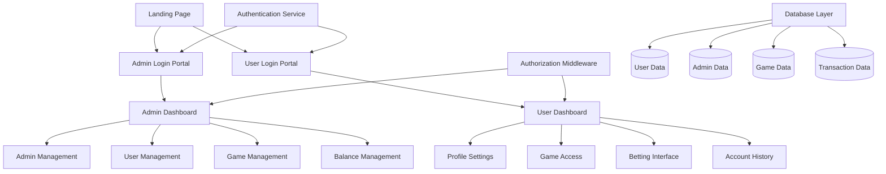
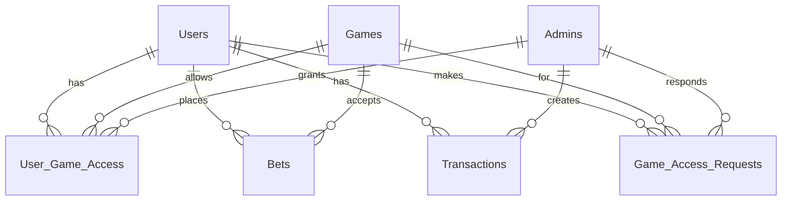

# Design Document

## Overview

The dual authentication betting platform will be built using Next.js 15 with TypeScript, leveraging the existing project structure. The system implements role-based access control (RBAC) with separate authentication flows for administrators and users. The architecture emphasizes security, scalability, and maintainability through clear separation of concerns and robust session management.

## Architecture

### High-Level Architecture



### Technology Stack

- **Frontend Framework**: Next.js 15 with App Router
- **Language**: TypeScript
- **Styling**: Tailwind CSS 4.0
- **Validation**: Zod (already integrated)
- **Environment Management**: @t3-oss/env-nextjs
- **Authentication**: NextAuth.js (to be added)
- **Database**: SQLite with Prisma ORM (for development), PostgreSQL (for production)
- **Session Management**: JWT tokens with secure HTTP-only cookies
- **State Management**: React Context API for user/admin state

## Components and Interfaces

### Authentication Components

#### AuthProvider Context
```typescript
interface AuthContextType {
  user: User | Admin | null;
  role: 'user' | 'admin' | null;
  login: (credentials: LoginCredentials, role: 'user' | 'admin') => Promise<void>;
  logout: () => void;
  isLoading: boolean;
}
```

#### Login Forms
- **AdminLoginForm**: Dedicated form component for admin authentication
- **UserLoginForm**: Dedicated form component for user authentication
- **LoginLayout**: Shared layout component for both login portals

### Dashboard Components

#### Admin Dashboard Components
- **AdminSidebar**: Navigation for admin functions
- **AdminManagement**: CRUD operations for admin accounts
- **UserManagement**: User profile and settings management
- **GameManagement**: Game access control interface
- **BalanceManagement**: User balance adjustment interface

#### User Dashboard Components
- **UserSidebar**: Navigation for user functions
- **ProfileSettings**: Username modification interface
- **GameAccessRequest**: Form for requesting game permissions
- **BettingInterface**: Game-specific betting components
- **AccountHistory**: Balance and betting history display

### Core Interfaces

#### User Types
```typescript
interface User {
  id: string;
  username: string;
  email: string;
  balance: number;
  enabledGames: string[];
  createdAt: Date;
  updatedAt: Date;
}

interface Admin {
  id: string;
  username: string;
  email: string;
  role: 'admin';
  createdAt: Date;
  updatedAt: Date;
}

interface Game {
  id: string;
  name: string;
  description: string;
  isActive: boolean;
  minBet: number;
  maxBet: number;
}

interface Bet {
  id: string;
  userId: string;
  gameId: string;
  amount: number;
  outcome: 'pending' | 'won' | 'lost';
  createdAt: Date;
  settledAt?: Date;
}

interface Transaction {
  id: string;
  userId: string;
  type: 'deposit' | 'withdrawal' | 'bet' | 'win' | 'adjustment';
  amount: number;
  description: string;
  adminId?: string;
  createdAt: Date;
}
```

## Data Models

### Database Schema

#### Users Table
- id (UUID, Primary Key)
- username (String, Unique)
- email (String, Unique)
- password_hash (String)
- balance (Decimal, Default: 0)
- is_active (Boolean, Default: true)
- created_at (Timestamp)
- updated_at (Timestamp)

#### Admins Table
- id (UUID, Primary Key)
- username (String, Unique)
- email (String, Unique)
- password_hash (String)
- is_active (Boolean, Default: true)
- created_at (Timestamp)
- updated_at (Timestamp)

#### Games Table
- id (UUID, Primary Key)
- name (String)
- description (Text)
- is_active (Boolean, Default: true)
- min_bet (Decimal)
- max_bet (Decimal)
- created_at (Timestamp)
- updated_at (Timestamp)

#### User_Game_Access Table
- id (UUID, Primary Key)
- user_id (UUID, Foreign Key)
- game_id (UUID, Foreign Key)
- granted_by_admin_id (UUID, Foreign Key)
- granted_at (Timestamp)

#### Bets Table
- id (UUID, Primary Key)
- user_id (UUID, Foreign Key)
- game_id (UUID, Foreign Key)
- amount (Decimal)
- outcome ('pending' | 'won' | 'lost')
- multiplier (Decimal, Nullable)
- created_at (Timestamp)
- settled_at (Timestamp, Nullable)

#### Transactions Table
- id (UUID, Primary Key)
- user_id (UUID, Foreign Key)
- type ('deposit' | 'withdrawal' | 'bet' | 'win' | 'adjustment')
- amount (Decimal)
- description (String)
- admin_id (UUID, Foreign Key, Nullable)
- created_at (Timestamp)

#### Game_Access_Requests Table
- id (UUID, Primary Key)
- user_id (UUID, Foreign Key)
- game_id (UUID, Foreign Key)
- status ('pending' | 'approved' | 'denied')
- message (Text, Nullable)
- requested_at (Timestamp)
- responded_at (Timestamp, Nullable)
- responded_by_admin_id (UUID, Foreign Key, Nullable)

### Data Relationships



## Error Handling

### Authentication Errors
- **Invalid Credentials**: Clear error messages without revealing whether username or password is incorrect
- **Account Disabled**: Specific message for deactivated accounts
- **Session Expired**: Automatic redirect to appropriate login portal
- **Rate Limiting**: Protection against brute force attacks

### Authorization Errors
- **Insufficient Permissions**: Clear messaging when users attempt unauthorized actions
- **Role Mismatch**: Redirect to correct portal if wrong role attempts access
- **Resource Not Found**: Graceful handling of missing resources

### Business Logic Errors
- **Insufficient Balance**: Clear messaging for betting attempts with inadequate funds
- **Game Access Denied**: Informative messages about requesting access
- **Invalid Bet Amount**: Validation messages for bet limits
- **Concurrent Modifications**: Optimistic locking for balance updates

### Error Response Format
```typescript
interface ErrorResponse {
  success: false;
  error: {
    code: string;
    message: string;
    details?: Record<string, string>;
  };
}
```

## Testing Strategy

### Unit Testing
- **Authentication Logic**: Test login/logout flows for both roles
- **Authorization Middleware**: Verify role-based access control
- **Business Logic**: Test betting calculations, balance updates
- **Data Validation**: Test Zod schemas and input validation
- **Component Logic**: Test React component behavior and state management

### Integration Testing
- **API Routes**: Test all Next.js API endpoints
- **Database Operations**: Test CRUD operations and transactions
- **Authentication Flow**: End-to-end login/logout testing
- **Role-Based Access**: Test dashboard access for different roles

### End-to-End Testing
- **User Journey**: Complete user registration to betting flow
- **Admin Journey**: Admin login to user management operations
- **Cross-Role Interactions**: Admin actions affecting user experience
- **Security Testing**: Attempt unauthorized access and privilege escalation

### Security Testing
- **SQL Injection**: Test database query security
- **XSS Prevention**: Test input sanitization
- **CSRF Protection**: Verify token-based protection
- **Session Security**: Test session hijacking prevention
- **Password Security**: Test hashing and validation

### Performance Testing
- **Load Testing**: Simulate concurrent user betting
- **Database Performance**: Test query optimization
- **Session Management**: Test concurrent session handling
- **Memory Usage**: Monitor for memory leaks in long-running sessions

### Test Environment Setup
- **Test Database**: Isolated SQLite database for testing
- **Mock Services**: Mock external dependencies
- **Test Data**: Seed data for consistent testing
- **CI/CD Integration**: Automated testing in deployment pipeline